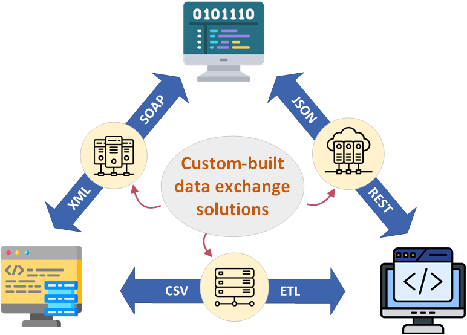
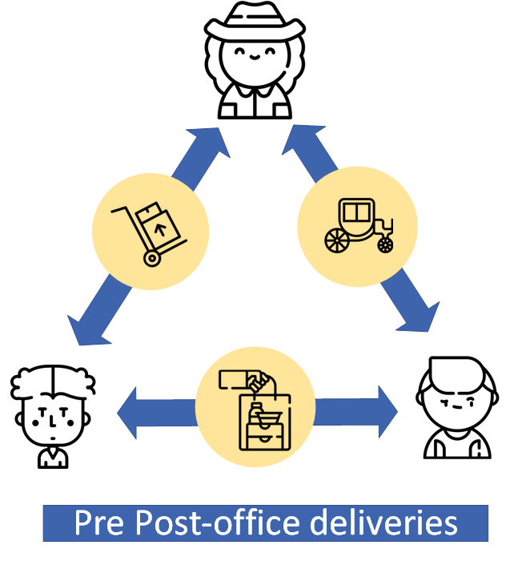
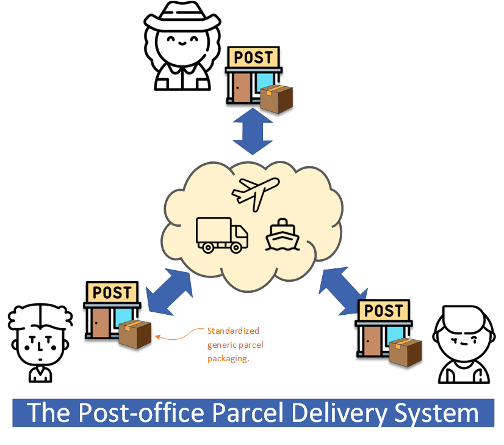
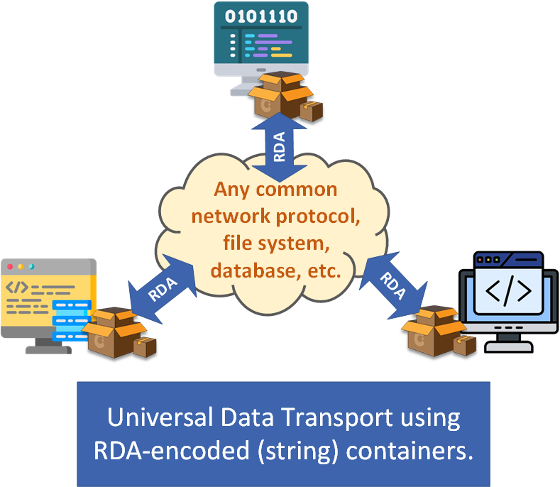

# Recursive Delimited Array (RDA) - Background Overview

Recursive Delimited Array (RDA) is a plain-text format designed for **schema-less data exchange**.

Unlike XML or JSON, which require sender and receiver to agree on a shared schema, RDA allows applications to exchange structured data without depending on a fixed data model. This makes systems easier to evolve independently while remaining interoperable.

> _Self-binding_ means a data object decides how to map its own fields to and from the RDA container, instead of relying on an external schema or code generator. It allows the sender and receiver to interpret the data only when they consume it.

---

## Why RDA?

Many integration technologies rely on predefined schemas (XML, JSON, Protocol Buffers, etc.). While these work well when both systems evolve together, they become increasingly expensive to maintain as applications change independently.

RDA takes a different approach.

Instead of transporting predefined object structures, it transports generic structured data. Applications are responsible for converting between their own native data models and RDA during sending and receiving.

This provides:

- Loose coupling between systems
- Version independence
- Dynamic extensibility
- Simple plain-text transport over HTTP, TCP/IP, FTP, messaging systems, files, databases, and more

---

## The moving-house analogy

Imagine moving house.

Furniture is disassembled, packed into boxes, transported, and then reassembled at the destination. The freight company never needs to know what is inside each box.

Data exchange can work the same way.

Applications disassemble complex objects into generic RDA containers for transport. The receiving application reconstructs the objects after delivery.

> RDA is the "box" for data transport.

Unlike using schema-based formats, the RDA-based transport layer does not impose restrictions on the structure of the data being carried, allowing loosely coupled integration by moving data validation to the application layer.

---

## Loose-coupled data exchange - the big picture

Traditional system integration often requires dedicated data pipelines based on fixed schemas.

This is similar to arranging a custom courier service for every parcel.

Postal services reduce cost by transporting standardized packages instead of requiring knowledge of every parcel's contents.

RDA applies the same principle to software integration.

Applications exchange generic containers instead of tightly coupled object models.

The result is a transport layer that is simpler, more reusable, and less dependent on shared schemas.

---

## Charian

RDA is accompanied by **Charian**, a lightweight serialization API for encoding, decoding, and manipulating RDA data.

Rather than exposing a schema-driven object model, Charian uses RDA as a generic hierarchical container that applications can populate, transport, and reconstruct data objects as required.

Because an RDA container can itself recursively contain other RDA containers[1], data objects with arbitrarily deep hierarchical structures can be represented naturally.

Code examples for C#, Python, and Java are available in [the Charian repository](https://github.com/foldda/charian).

[1]: RDA objects support only two data types: strings or RDA objects. It's an application's responsibility to validate and convert data in these forms to its native type, and to handle any possible exceptions.

---

## Snappable

RDA was originally created for [**Snappable**, an open-source component framework](https://github.com/foldda/snappable) that allows independently developed software components to communicate without requiring a shared object model.

Each component converts between its native data structures and RDA, allowing components from different vendors to interoperate through self-binding.

The following video demonstrates how Snappable achieves its design goals using RDA and data object self-binding:

https://www.youtube.com/watch?v=Uek9aW1qToU

## Learn More

The [project Wiki](https://github.com/foldda/rda/wiki) contains additional details, including:

- RDA encoding rules
- Charian API
- Design philosophy
- Practical usages

(NB - some wiki pages are unfinalized and/or under construction.)

---

## Claude AI's View

From a discussion with Claude AI, it summarises RDA as -

> RDA is CSV extended with recursion and self-declared delimiters, while deliberately not adopting JSON's key-value naming or type system.

The discussion also includes Claude AI's comparison of RDA against XML/JSON/CSV, Protobuf, and Avro

https://claude.ai/share/b75c3360-f61d-4216-ada6-422d0ea8a934

---

## License

Released under the MIT License.

"Recursive Delimited Array" and "RDA" are trademarks of Foldda Pty Ltd.
