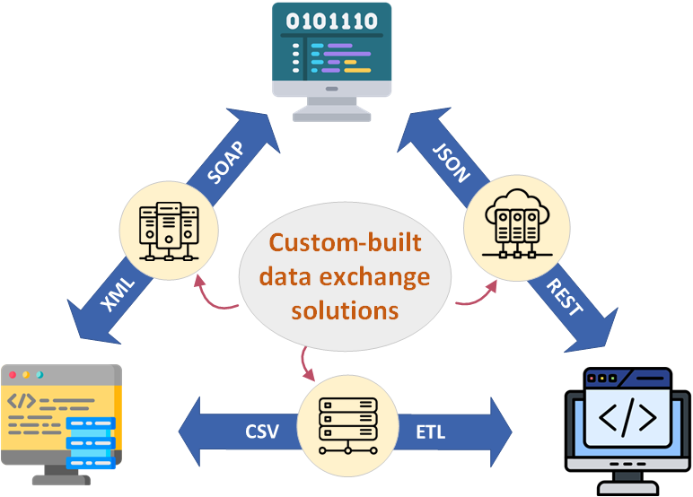
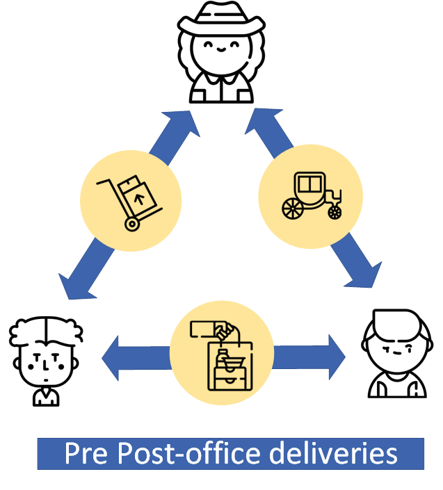
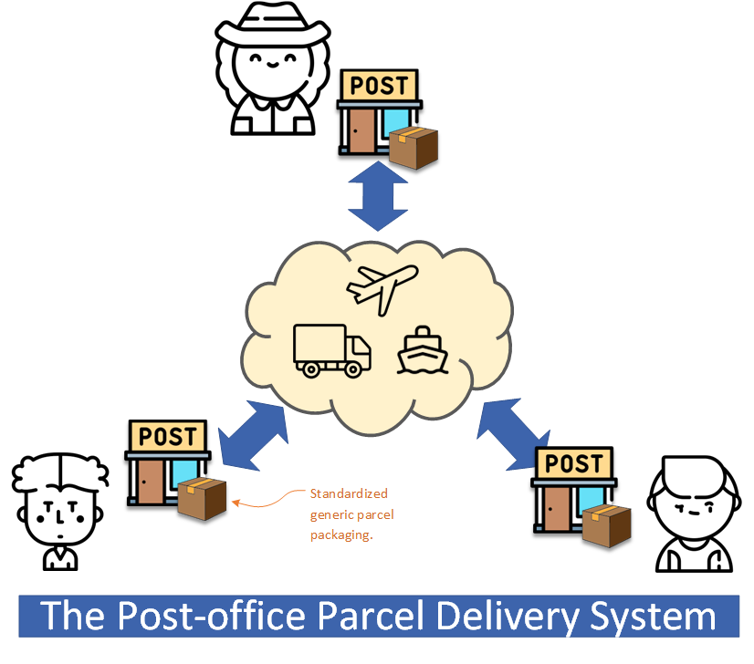
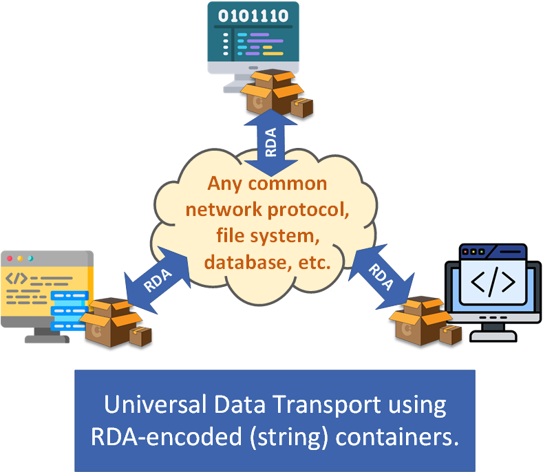

# Recursive Delimited Array 
[](https://github.com/sindresorhus/awesome#readme)


Recursive Delimited Array (RDA) is a plain-text data format for encoding structured data as text strings. RDA uses a simple, delimiter-based encoding, similar to CSV, but supports encoding more complex data structure compared to CSV.

An RDA-encoded string (an "RDA string") has two substring sections - a "header" and a "payload". The header substring contains definition of the string's encoding chars definition[^1], and the payload substring contains the encoded data elements. It allows a parser program to configure itself dynamically when reading the header, and subsequently parse the string's payload content.

[^1]: A more detailed explanation of RDA encoding rule is in [this repo's wiki](https://github.com/foldda/rda/wiki).

In the example below, the header (substring "|\\|") defines a delimiter (the first char '|') which is used to encode the payload (substring "One|Two|Three"), where three data elements ("One","Two", and "Three") are separated using the delimiter. 

```
|\|One|Two|Three
```

By dynamically expanding the header and defining more delimiters, RDA encoding supports encoding multi-dimensional data. In the next example, there are two delimiters defined in the RDA string's header, delimiter '|' and deleimiter ',', and the string contains an encoded 2-D data table: the rows (first-dimension) are separated by delimiter '|', and the columns (second-dimension) in each row are separated by deleimiter ','. 

```
|,\|Name,Sex,Age|Mary,F,52|John,M,70|Kate,F,63
```

| Name | Sex | Age | 
|------|-----|-----|
| Mary | F   | 52  | 
| John | M   | 70  |
| Kate | F   | 63  | 

## Data Exchange Late-Binding 

> In programming, late-binding allows a prpogram to adapt to changing environments, handle unknown object types, and avoid strict type-dependent links.

When two programs exchange data between each other using XML or JSON encoding, they must first agree to a data format (i.e. an XML/JSON schema) for the data-exchange. This can be a problem if the exact format for the data cannot be certain innitially, or can have varians, or can change (as they do) over time. It would be bebeficial if the data format can be determined later and the varians be dealt with accordingly by either or both the sender and the receiver, something we call "data exchange late-binding". Similar to the late-binding in programming, late binding in data exchange offers significant advantages in flexibility, version independence, and dynamic extensibility to the sender and the receiver.

But how can we achieve data exchange late binding? Let's explain our approach with an analogy. 

Imagine you're moving house: you would first pack household items into boxes, disassemble them if required, and once the boxes are delivered to the new place, perhaps by a freight company, you would unpack the boxes, reassemble the items, and re-place them to their designated places. Note in this process, the sender, the receiver, and through the process no party needs to agree the exact shape and the size of each household item - everything is wrapped in generic box containers until the time the receiver unwrap the packaging and "consumes" the box's content. 

> Data exchange late binding requires a "plain box" data container that is 1) be capable to carry arbitarily complex data, and 2) not to be restricted to a certain fixed data structure. 

As discussed earlier, XML/JSON based data exchange are schema-dependent that restricts on data format, and the schema-less CSV encoding is too primitive for carrying complex structured data. In contrast, **RDA encoding allows data exchange late-binding** because it's schema-less unlike XML/JSON, and supports encoding complex structured data unlike CSV.

## Charian - A RDA-Encoding API

Charian is an easy-to-use API for transparently encoding and parsing RDA formated strings. It is available in C#, Python, and Java [from its GitHub repo](https://github.com/foldda/charian), and the working concept is briefly explained below using the C# API implementation as example.

### The Rda Class (C#)

If we think an RDA string is the container used in late-binding data transportation, a program would only care about "packing" its data into the container before the transportation, and "unpacking" its data after the transportation, so in the API, it hides the RDA encoding details and models an RDA string a data container object that has setter and getter methods for storing data into and retrieve data from it. 

```csharp
class Rda
{
    //methods for storing data element values inside an indexed space that an RDA string provides
    public void SetValue(string value, int[] address);  /* save a string value at the index-addressed location */
    public string GetValue(int[] address);        /* retrieve a string value from the index-addressed location */
    public void SetRda(Rda rda, int[] address);      /* save an Rda object at the addressed location */
    public Rda GetRda(int[] address);      /* retrieve an Rda object from the addressed location */

    //serialize this Rda object to an RDA-encoded string, for transportation
    public override string ToString();
}
```

You may have noticed the API's Rda class supports storing only two data type values: the first is type "string", the second is type "Rda" (via recurrsion). The recurrsion takes advantage of an RDA string's interesting property for havinv a "**recursive storage structure**", that is, you can store an Rda object inside another Rda object. That's because the RDA's multi-dimensional encoding space can be (almost) unlimited expanded into new deminsions (through introducing additional dilimiters to the encoding process), and any one sub-dimension is also a multi-dimensional array itself and offers the same storaging property and capacity as its containing parent-dimension. Reflecting this in the API is that an Rda object (having a multi-dimensional space) can be stored inside another Rda object (as one of its sub-dimensions).

In the following example code it sends random data, as a serialized RDA string using the API, to a file, then reads and restores the data from the file.

```csharp
    using Charian;

    class RdaDemo1
    {
        public void Main(string[] args)
        {
            //a file is used as the physical media/channel for the data transport
            string PATH = "C:\\Temp\\file1.txt";

            //as sender ...
            SendSomeData(PATH);

            //as receiver ...
            ReceiveSomeData(PATH);
        }

        void SendSomeData(string filePath)
        {

            Rda rda1 = new Rda();    //create an Rda object which provides a storage space

            //placing some data items into the storage space (all as strings)
            rda1.SetValue(0, "One");  //storing a string value at index = 0
            rda1.SetValue(1, "Two");  //storing a decimal value at index = 1
            rda1.SetValue(2, "Three");  //storing a date value

            string encodedRdaString = rda1.ToString();     // => "|\|One|Two|Three"

            File.WriteAllText(filePath, encodedRdaString);  //output to a physical media
        }

        void ReceiveSomeData(string filePath)
        {
            string encodedRdaString = File.ReadAllText(filePath);  //input from a physical media

            Rda rda1 = Rda.Parse(encodedRdaString);    //decode the RDA string and restore an Rda "box" object

            //"unpacking" the data items from the box's content
            string a = rda1.GetValue(0);  //retrieve the stored value ("One") from location index = 0
            string b = rda1.GetValue(1);
            string c = rda1.GetValue(2);
        }
    }
```

### The IRda Interface (C#)

Data objects implement this interface is capable to turn itself to/from an Rda object, which can be transported/exchanged in late-binding fashion. 

```csharp
interface IRda
{
    /* "packing": return an Rda object contains this data object's elements/properties values  */
    Rda ToRda();

    /* "unpacking": restore this data object's elements/properties values from an Rda object */
    IRda FromRda(Rda rda);  
    //... ...
}
```
In the below example, the Address class implements the IRda interface and is serializable. 

```csharp
    class Address : IRda
    {
        public enum RDA_INDEX : int { LINES = 0, ZIP = 1 }

        public string AddressLines = "Line 1\nLine 2\nLine 3";
        public string ZIP = "NY 21540";

        //"packing" properties into an Rda container
        public Rda ToRda()
        {
            var rda = new Rda();  //create an RDA container
            // properties
            rda[(int)RDA_INDEX.LINES].ScalarValue = this.AddressLines;
            rda[(int)RDA_INDEX.ZIP].ScalarValue = this.ZIP;
            return rda;
        }

        //"unpacking" and restoring properties from an Rda container
        public IRda FromRda(Rda rda)
        {
            this.AddressLines = rda[(int)RDA_INDEX.LINES].ScalarValue;
            this.ZIP = rda[(int)RDA_INDEX.ZIP].ScalarValue;
            return this;
        }
    }
```
Charian allows easily serializing complex data objects into RDA strings for easy late-binding data exchange, and is available in multiple lanugages. Because strings are a generic data format supported in all modern languages and platforms, when using the API, cross-language and cross-platform systems data exchange are no longer difficult.

## Snappable - Data Exchange Late-Binding In Practice

[Snappable](https://github.com/foldda/snappable) is an open-source component-based computing framework, for assembling software applications using reusable and interchangeable software components. One of Snappable's design requirement is to allow third-parties' compatible software components to connect and work together. This is an ideal case for data exchange late binding, because these components won't necessary have any prior knowledge of the data model used by each other. In fact, RDA and data exchange late-binding are created for this design requirement, and RDA is a primary data type used throughout the Snappable framework for data exchange.

[This demo video](https://www.youtube.com/watch?v=Uek9aW1qToU) visually demonstrates Snappable components in-action. It shows how an app can be assembled "physically" form pre-built interchangeable Snappable components.

The Snappable API defines software component intefaces that implements data exchange late binding, so components can "plug" themselves to the framework and "talk" to each other in a generic, consistant way. These allow the user can assemble apps using physical component assemblies, rather than having to rebuild/recompile source code everytime, and being locked-in by a specific data model from the component vendor, because these off-market components are "pluggable", reusable and interchangeable.  

In Snappable, a compatible component implementing the late binding is required to convert its "native data" to and from RDA, possibly by using [Charian](https://github.com/foldda/charian), so the data (carried within an RDA) can flow through the system. For example, there is a  HL7FileReader component implements the conversion from HL7 to RDA, and the HL7FileWriter component does the opposite conversion, and these two components (both available in the Snappable GitHub repo) can be connected and used in an app that requires HL7 data file reading and writing.

The Snappable framework API and many of its ready-to-use portable components are available in [this GitHub repo](https://github.com/foldda/snappable).

## The Bigger Picture

Today, most cross-system data exchange are using dedicated pipelines. Most likely, the fixed data models used in these custom-built pipelines make the connected programs “tightly coupled” - meaning they are inflexible and expensive not just financially but also in maintanance and operational complexity.

<div align='center'>

</div>

This is like sending parcels to people through adhoc transport and delivery arrangements rather than using the Post Office, which is expensive and inflexible. 

<div align='center'>

</div>

We are all used to using Postal services for posting parcels because the shared logistics and freight system helps cut down the cost. Postal servises' standardized packaging (i.e. envelops and boxes) is also flexible in meeting various clients' requirements - for posting parcels of different shapes and sizes.

<div align='center'>

</div>

So for data exchange between isolated independent systems, we could do something similar to the Post Office's postal service, to cut down the costs and improve flexibility.  

<div align='center'>

</div>

By using the schema-less RDA and through late-binding, data can be exchanged between individual programs with generic and low-cost intermedia data transport layer, i.e. via text-based networks or messaging protocols, such as HTTP/RPC, TCP/IP, and FTP. As in the moving house analogy, these low-cost generic data links are like using cheap "freight companies", that is, to be based on simple and low-cost data transports, because sender and receiver programs can use generic APIs (eg file-system, RDBMS, FTP, MSMQ APIs) for cross-system data transfer, in contrast to building higher cost dedicated pipelines using XML/JSON encoding, where sender and receiver programs must maintain inflexible data-handling logic for the data exchange.

## More Details 

The [wiki of this project](https://github.com/foldda/rda/wiki) contains more details about RDA, including - 

- [RDA overview.](https://github.com/foldda/rda/wiki#1-introduction) - explains the background and philosophy of this project.
- [Using the API.](https://github.com/foldda/rda/wiki#2-using-the-api) - contains more technical details, with a practical example. 
- [FAQ.](https://github.com/foldda/rda/wiki#4-faq) - miscellaneous topics and dicsussions.

## Legal 

This project is licensed under the MIT License - see the [LICENSE](LICENSE) file for details. 

"Recursive Delimited Array" and "RDA" are trademarks of [Foldda Pty Ltd](https://foldda.com).

